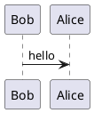

RedmineでPlantUMLを書くことのできるプラグインを2つ紹介したいと思います。

<!--more-->

## PlantUMLとは？

UMLを書くとき、Visioを使ったり、ExcelやPowerPointでゴリゴリ書いたり、または専用のモデリングツールを使ったりしますが、ファイルフォーマットがバイナリデータだとバージョン管理に不向きだし、Diffも取りづらいですよね。このような理由により、最近だとテキストでUMLを書くことのできる [PlantUML](http://plantuml.com/) や [Mermaid.js](https://mermaidjs.github.io/) が（私の中で）人気を博しています。

PlantUMLでは、以下のような独自のフォーマットで記述することにより、自動的にダイアグラムを生成することができます。生成可能なファイルフォーマットはPNG/SVG/LaTeX（シーケンス図のみアスキーアートも可）です。

PlantUMLはJavaで書かれていますので、使用するにはJavaの実行環境が必要です。または、PlantUML Serverを導入する必要があります。

ここではPlantUMLの書き方や導入方法については言及しませんので、もっとPlantUMLについて知りたい方は、[公式サイト](http://plantuml.com/)や、インターネット上の文献を探してみて下さい。たくさん見つかります。

## RedmineのPlantUMLプラグイン

Redmineで PlantUML を書くためのプラグインは2つあります。それぞれの特徴を紹介したいと思います。

### PlantUML plugin

[@dkd](https://github.com/dkd)さんの [PlantUML Plugin for Redmine](https://github.com/dkd/plantuml) です。こちらのプラグインは[RedmineのPlugins Directory](https://www.redmine.org/plugins/plantuml)に登録があります。

このプラグインは、プラグイン本体の他に、PlantUMLのバイナリファイルとPlantUMLをコールするスクリプトをRedmineのサーバ上に配置する必要があります。Redmineのサーバを汚しますが、そのかわり別のサーバを立てる必要はありません。

### PlantUML Redmine Macro

[@gelin](https://bitbucket.org/gelin)さんの [PlantUML Redmine Macro](https://bitbucket.org/gelin/plantuml-redmine-macro) です。こちらのプラグインはPlugins Directoryには登録されていません。

このプラグインは外部のPlantUML Serverに対してリクエストする方式です。デフォルトでは http://plantuml.com/plantuml/ に対してリクエストするようになっていますが、設定により変更することが可能です。

とはいえ、ローカル環境にPlantUML Serverを立てたほうが無難でしょう。Dockerの心得がある方であれば、[PlantUMLのオフィシャルのDockerイメージ](https://hub.docker.com/r/plantuml/plantuml-server/)がありますので、これを使えばPlantUML Serverを簡単に立てることができます。

## どちらのプラグインを使うべきか

Redmineから話が逸れますが、[PlantUML ServerがあればGitLab上でもPlantUMLを表示できます](https://docs.gitlab.com/ee/administration/integration/plantuml.html)。私の所属するチームではGitLabを使用していることもあり、どうせPlantUML Serverが必要なので後者の[PlantUML Redmine Macro](https://bitbucket.org/gelin/plantuml-redmine-macro)を使用しています。また、Redmineサーバ上にバイナリファイルを配置する必要もないため、Redmineのバージョンアップ時にも余計な考慮が不要です。

PlantUML Serverを立てることが億劫であれば、[@dkd](https://github.com/dkd)さんのプラグインを使うほうが良いように思います。

## さいごに

PlantUMLプラグインを導入して快適なUMLライフを過ごしましょう！（PlantUMLもいいけど[Mermaid](https://github.com/taikii/redmine_mermaid_macro)もね）

