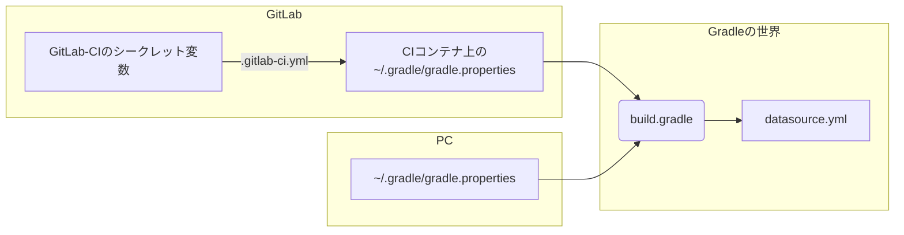

CIで自動テストをする際にDBなどの接続情報をどうやって渡してますか？

<!--more-->

GitLab-CIはDockerコンテナ上で実行されますよね。ビルドツールにGradleを使っているので[Docker LibraryのGradleイメージ](https://hub.docker.com/_/gradle/)を使ってCIを実行しています。もちろんローカルでもテストを実行しますので、ローカルでもGitLab-CI上でも同じようにテストをするために、以下のような環境にしています。




シークレット変数はコンテナの環境変数として展開されるので、それを`gradle.properties`に吐いて、PC上と同じ環境を装う感じです。

`.gitlab-ci.yml`は以下のようになっています。

```yaml
before_script:
  - export GRADLE_USER_HOME=`pwd`/.gradle
  - mkdir -p ${GRADLE_USER_HOME}
  # gradle.propertiesが残ってたらクリア
  - echo -n > ${GRADLE_USER_HOME}/gradle.properties
  - printenv | grep "^MYSECRETS_" >> ${GRADLE_USER_HOME}/gradle.properties
```

試行錯誤の結果なんですが、みなさんどんな感じでやってるんでしょうかね？？？
